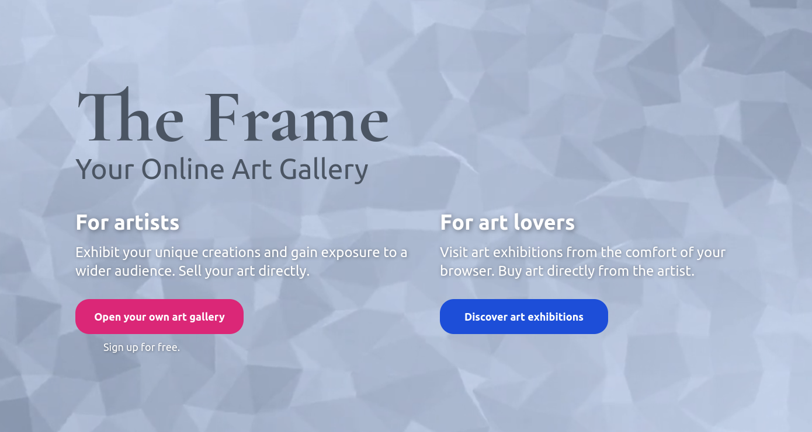
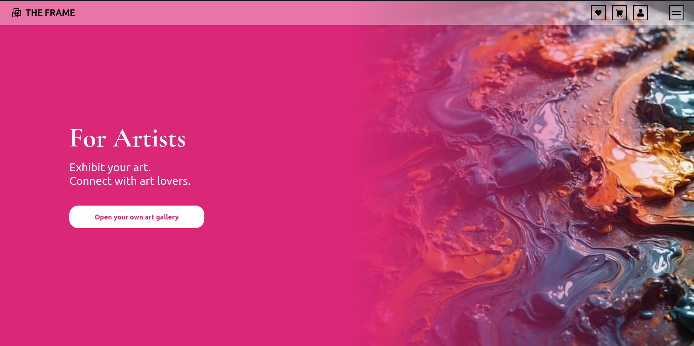
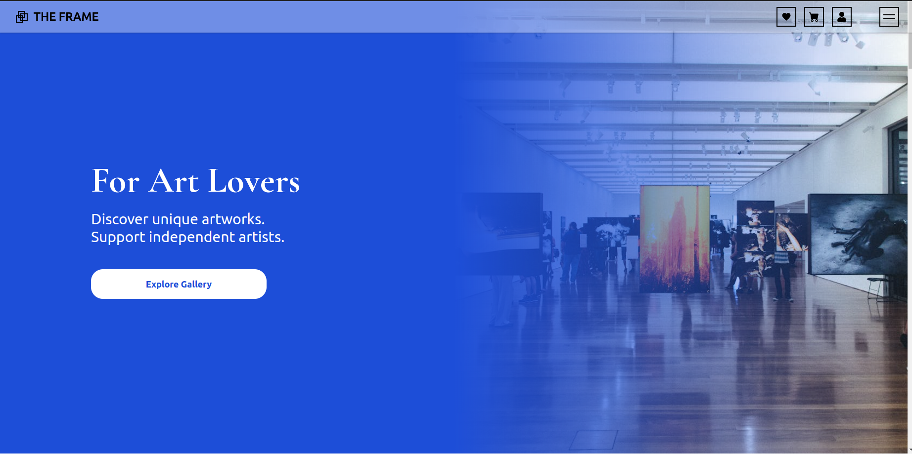
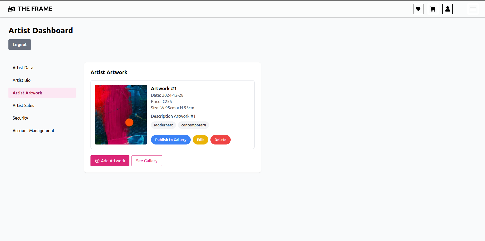
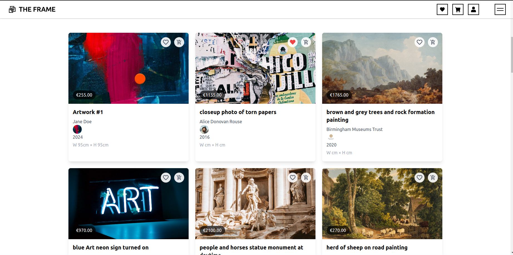

# The Frame 🎨 Online Art Gallery

'The Frame' is an art marketplace platform where artists can showcase their work and art lovers can browse, favourite, and purchase artwork. Built with React, Vite, and TailwindCSS, featuring Firebase integration for authentication and storage.

This project was created as my final React SPA module project and is my first fully responsive and tested application! 🎉 It therefore represents a significant personal growth in my development journey! 

🔗 [Visit the live demo here!](https://online-art-gallery-react.vercel.app/)

 

## Table of Contents

- [Key Features](#key-features)
- [Tech Stack](#tech-stack)
- [Technical Challenges and Solutions](#technical-challenges-and-solutions)
- [Project Structure](#project-structure)
- [Acknowledgments](#acknowledgments)
- [Preview](#preview)

## Key Features

#### 🎨 For Artists 

- Upload artwork with detailed information
- Set prices and track engagement
- Artist dashboard

#### 💖 For Art Lovers 
 
- Save favourites for later
- Shopping cart functionality
- Detailed artwork views
- Art lover dashboard

#### 💫 User Experience

- Responsive design for all devices
- Intuitive navigation
- Real-time notifications using React Hot Toast
- Smooth animations

#### 🔐 Authentication & Data

- Firebase Authentication for user management
- Firestore database for storing artwork data
- Base64 image storage solution
- Real-time data updates across components
- Guest browsing with limited features
- Hybrid data source (Firebase + Unsplash API)

## Tech Stack

### Frontend
- React 18 with Vite
- TailwindCSS for styling
- React Router v7 for navigation
- React Context API for state management
- React Hot Toast for notifications

### Backend & Services
- Firebase Authentication
- Firebase Firestore Database
- Unsplash API for artwork gallery
- Base64 image storage solution
- Vercel for deployment

### Testing
- Vitest for unit and integration testing
- Cypress for E2E testing
- React Testing Library

## Technical Challenges and Solutions

### 1. Image Storage in Firebase Free Tier
One of the biggest challenges was working within Firebase's free tier limitations while allowing artists to upload their artwork. Firebase Storage free tier has strict limitations and I needed to maintain image quality while reducing storage usage.

💡 **The Solution**: Implemented a Base64 conversion strategy (converted uploaded JPGs to Base64 strings before storage). The downside is that this requires users to upload smaller images - not ideal but it works and will do for now.

### 2. Real-time Data Updates Across Components
Another significant challenge was maintaining data consistency across different pages when artists updated their artwork details and their personal profiles. Changes needed to reflect immediately in favourites, cart, checkout, and artwork pages.

💡 **The Solution**: Used React Context to keep track of all data in one central place. This way, when an artist makes a change, every page can see and display the updated information right away. Still, managing data updates was very tricky because different components needed different pieces of the same artwork data, and updates had to sync with Firebase in real-time. 

## Project Structure

src/     
├── components/       
│ ├── auth/     
│ ├── common/    
│ └── layout/    
│     
├── contexts/    
│ └── AuthContext    
│     
├── pages/    
│ ├── ArtistDashboard    
│ ├── ArtworkPage    
│ ├── BecomeArtist    
│ ├── CartPage    
│ ├── CheckoutPage    
│ ├── CheckoutSuccessPage     
│ ├── FavoritesPage     
│ ├── ForArtistsPage      
│ ├── ForArtLoversPage     
│ ├── HomePage     
│ └── UserDashboard     
│      
├── config/    
│ └── firebase.js    
│       
├── tests/     
│ ├── cypress/     
│ └── vitest/      

## Acknowledgments

A big thanks to [Virtual Art Gallery](https://virtualartgallery.com/) for inspiring the design of this application. Their outstanding platform provided valuable insights that shaped my approach to building my art marketplace.

## Preview

#### For Artists Page

#### For Art Lovers Page

#### Artist Dashboard (upload artwork)

#### Art Gallery (browse artwork)

 

---

Created with ❤️ and React by [Cátia Monteiro](https://github.com/diecatiamonteiro).     
Thanks for reading!