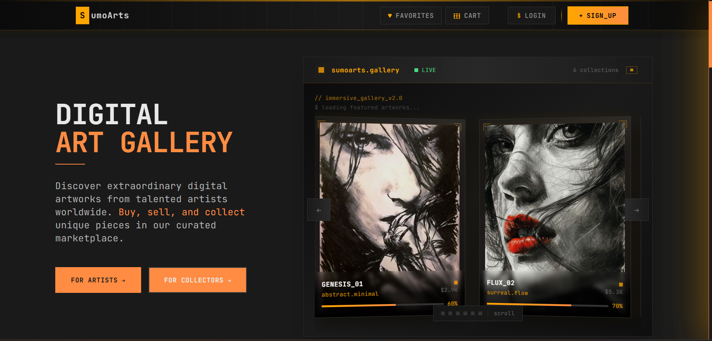

# SumoArts 🎨 Digital Art Gallery

SumoArts is a modern, lofi-aesthetic digital art gallery platform where artists can showcase their work and art enthusiasts can discover, collect, and purchase unique artworks. Built with React, featuring a terminal-inspired design with cyberpunk elements.

This project represents a complete digital art marketplace with a unique lofi/cyberpunk aesthetic, focusing on clean design and smooth user experience.

🔗 **Live Demo**: [Visit SumoArts Gallery](https://github.com/whatsupsumit/SumoArts)


<br>

## Table of Contents

- [Key Features](#key-features)
- [Tech Stack](#tech-stack)
- [Design Philosophy](#design-philosophy)
- [Project Structure](#project-structure)
- [Installation](#installation)
- [Screenshots](#screenshots)
- [Contributing](#contributing)
- [License](#license)

## Key Features

### 🎨 For Artists 

- **Gallery Studio**: Pinterest-style upload interface with drag & drop functionality
- **Artist Dashboard**: Complete artwork management and analytics system
- **Professional Presentation**: Lofi-styled artwork showcasing with terminal aesthetics
- **Custom Collections**: Organize artworks by size, category, and themes
- **Real-time Updates**: Instant artwork publishing and management

### 💖 For Art Collectors
 
- **Curated Discovery**: Browse through carefully selected digital artworks
- **Smart Collections**: Save favorites with advanced filtering and search
- **Secure Experience**: Streamlined browsing with user authentication
- **Collector Dashboard**: Track favorites and discover new artists
- **Interactive Gallery**: Immersive artwork viewing with smooth animations

### 💫 User Experience

- **Lofi Aesthetic**: Terminal-inspired design with cyberpunk elements
- **JetBrains Mono Typography**: Consistent coding-style fonts throughout
- **Responsive Design**: Optimized for desktop, tablet, and mobile devices
- **Smooth Animations**: Glitch effects, hover transitions, and loading states
- **Terminal Navigation**: Cool back buttons with breadcrumb systems
- **Dark Theme**: Professional dark interface with orange (#FFA500) accents

### 🔐 Technology & Performance

- **React 18**: Modern component architecture with hooks
- **Firebase Integration**: Real-time data and secure authentication
- **Advanced State Management**: Context API for seamless data flow
- **Optimized Performance**: Fast loading with Vite bundler
- **Modern Routing**: React Router v7 for smooth navigation

## Tech Stack

### Frontend
- **React 18** with Vite for lightning-fast development
- **TailwindCSS** for utility-first styling and responsive design
- **React Router v7** for seamless client-side navigation
- **React Context API** for global state management
- **React Hot Toast** for elegant user notifications

### Backend & Services
- **Firebase Authentication** for secure user management
- **Firebase Firestore** for real-time database operations
- **Base64 Storage** for efficient image handling and storage
- **Modern ES6+** JavaScript with async/await patterns

### Design System
- **JetBrains Mono** typography for authentic coding aesthetic
- **Lofi Color Palette** with signature orange (#FFA500) accents
- **Terminal-inspired UI** components with glitch effects
- **CSS Grid & Flexbox** for responsive layouts
- **Custom animations** with CSS transitions and transforms

## Design Philosophy

SumoArts embraces a **lofi cyberpunk aesthetic** that combines:

- **Terminal Aesthetics**: Command-line inspired interfaces and navigation
- **Coding Typography**: JetBrains Mono font family throughout the application
- **Glitch Effects**: Subtle animations, hover states, and visual feedback
- **Dark Theme**: Professional dark backgrounds with vibrant orange highlights
- **Clean Minimalism**: Following the "Pure Art. No Gatekeepers." philosophy
- **Interactive Elements**: Smooth transitions and engaging user interactions

## Project Structure

```
src/     
├── components/       
│   ├── auth/           # Login, Register, and auth components
│   ├── common/         # Reusable UI components and utilities
│   └── layout/         # Navbar, Footer, and layout components
├── contexts/           
│   └── AuthContext.jsx # Global authentication state management
├── pages/              
│   ├── HomePage.jsx        # Landing page with immersive gallery
│   ├── GalleryStudio.jsx   # Pinterest-style artwork upload
│   ├── ForArtLoversPage.jsx # Art discovery and browsing
│   ├── ArtistDashboard.jsx  # Artist portfolio management
│   ├── Login.jsx           # User authentication
│   └── Register.jsx        # User registration
├── config/             
│   └── firebase.js     # Firebase configuration and setup
├── styles/             
│   └── index.css       # Global styling and CSS variables
└── Routes.jsx          # Application routing configuration
```

## Installation

### Prerequisites
- **Node.js** (v16 or higher)
- **npm** or **yarn** package manager
- **Firebase account** for backend services

### Setup Instructions

1. **Clone the repository**
   ```bash
   git clone https://github.com/whatsupsumit/SumoArts.git
   cd SumoArts
   ```

2. **Install dependencies**
   ```bash
   npm install
   ```

3. **Set up Firebase**
   - Create a new Firebase project at [Firebase Console](https://console.firebase.google.com/)
   - Enable Authentication (Email/Password method)
   - Enable Firestore Database
   - Copy your Firebase config and update `src/config/firebase.js`:

   ```javascript
   // src/config/firebase.js
   const firebaseConfig = {
     apiKey: "your-api-key",
     authDomain: "your-project.firebaseapp.com",
     projectId: "your-project-id",
     storageBucket: "your-project.appspot.com",
     messagingSenderId: "your-sender-id",
     appId: "your-app-id"
   };
   ```

4. **Start the development server**
   ```bash
   npm run dev
   ```

5. **Open in browser**
   - Navigate to `http://localhost:5173`
   - Create an account or log in to start exploring!

### Build for Production

```bash
npm run build
```

## Screenshots

### 🏠 SumoArts Home - Immersive Gallery Experience

*Landing page with terminal-inspired navigation and interactive artwork slider*

### 🎨 Gallery Studio - Pinterest-Style Upload Interface

*Drag & drop artwork upload with lofi design and real-time preview*

### 💖 Art Discovery - Terminal-Inspired Browsing

*Curated artwork discovery with smooth filtering and collection features*

### 👨‍🎨 Artist Dashboard - Professional Management

*Complete artwork management with analytics and portfolio tools*

### 🔐 Authentication - Lofi Login Experience

*Terminal-styled authentication with smooth form transitions*

## Features in Detail

### Gallery Studio
- **Drag & Drop Upload**: Intuitive file upload with visual feedback
- **Image Preview**: Real-time preview before publishing
- **Metadata Management**: Add titles, descriptions, and tags
- **Size Options**: Small, medium, and large display formats
- **Instant Publishing**: One-click artwork publication

### Art Discovery
- **Curated Collections**: Hand-picked digital artworks
- **Advanced Filtering**: Search by style, artist, and category
- **Interactive Gallery**: Smooth hover effects and transitions
- **Favorites System**: Save and organize preferred artworks
- **Artist Profiles**: Discover and follow talented creators

### User Experience
- **Responsive Design**: Perfect on all screen sizes
- **Fast Loading**: Optimized images and code splitting
- **Offline Support**: Basic functionality without internet
- **Keyboard Navigation**: Accessible interface design
- **Screen Reader Friendly**: ARIA labels and semantic HTML

## Contributing

We welcome contributions to SumoArts! Here's how you can help:

### Getting Started
1. Fork the repository
2. Create a feature branch (`git checkout -b feature/amazing-feature`)
3. Make your changes
4. Commit your changes (`git commit -m 'Add amazing feature'`)
5. Push to the branch (`git push origin feature/amazing-feature`)
6. Open a Pull Request

### Contribution Guidelines
- Follow the existing code style and conventions
- Add comments for complex logic
- Test your changes thoroughly
- Update documentation as needed
- Use meaningful commit messages

### Areas We Need Help
- 🎨 UI/UX improvements and new design elements
- 🐛 Bug fixes and performance optimizations
- 📱 Mobile responsiveness enhancements
- 🔒 Security improvements and best practices
- 📚 Documentation and tutorial creation

## License

This project is licensed under the MIT License - see the [LICENSE](LICENSE) file for details.

## Contact & Support

- **GitHub**: [@whatsupsumit](https://github.com/whatsupsumit)
- **Project Repository**: [SumoArts](https://github.com/whatsupsumit/SumoArts)
- **Issues**: [Report a Bug](https://github.com/whatsupsumit/SumoArts/issues)

## Acknowledgments

- **Design Inspiration**: Terminal interfaces and cyberpunk aesthetics
- **Typography**: JetBrains Mono font family
- **Icons**: Custom ASCII art and Unicode symbols
- **Community**: Thanks to all contributors and users

---

<div align="center">

**SumoArts** - Where creativity meets technology in a lofi digital space.  
Built with ❤️ using modern React architecture and terminal-inspired design.

*"Pure Art. No Gatekeepers."*


</div>
